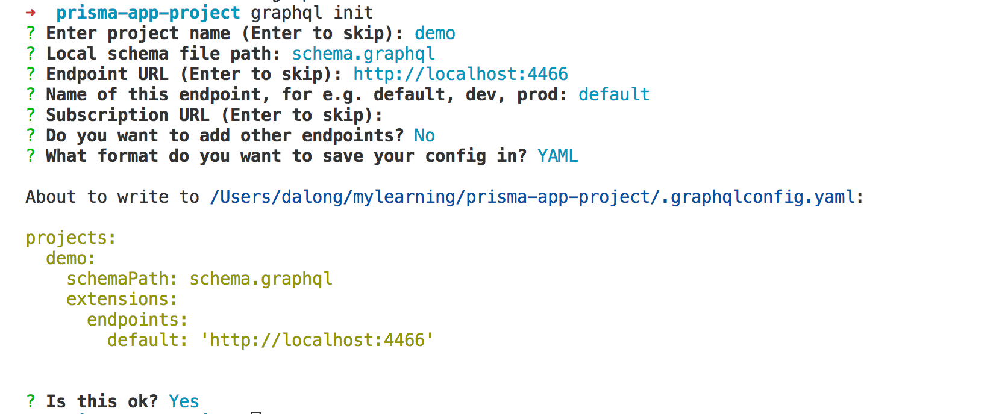
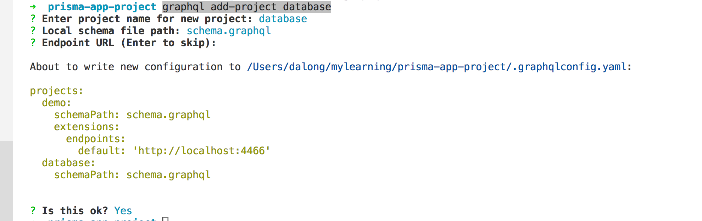
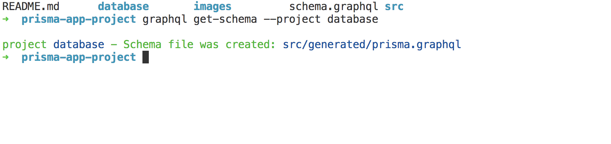

# graphql cli 开发graphql api flow

## 作用

- 代码生成

- schema 处理

- 脚手架应用创建

- 项目管理


## 安装cli

```code
npm install -g graphql-cli
```

## 初始化项目（使用.graphqlconfig管理）

> 以下为demo

* demo 项目创建

```code
graphql init
```


* 添加数据操作（一般名称为database）

> 使用prisma cli

```code
prisma init database
```

* 添加database 项目

```code
graphql add-project database
```



* 修改配置

> .graphqlconfig.yaml

```code

 projects:
  demo:
    schemaPath: schema.graphql
    extensions:
      endpoints:
        default: 'http://localhost:4466'
  database:
    schemaPath: src/generated/prisma.graphql
    extensions:
      prisma: database/prisma.yml

```

* 生成schema

```code
graphql get-schema --project database

```



* 代码生成

  * 生成typescript  typings

  > .graphqlconfig.yaml

  ```code

  projects:
    demo:
      schemaPath: src/schema.graphql
      extensions:
        endpoints:
          default: 'http://localhost:4466'
        codegen: 
          generator: typegen
          language: typescript
          input: "{binding,prisma}/*.ts"
          output:
            typings: src/typings.ts
    database:
      schemaPath: src/generated/prisma.graphql
      extensions:
        prisma: database/prisma.yml

  graphql codegen

  ```
  
  * 生成type 定义

  > 修改配置

    ```code
    projects:
    demo:
      schemaPath: src/schema.graphql
      extensions:
        endpoints:
          default: 'http://localhost:4466'
        codegen: 
          generator: prisma-binding
          language: typescript
          output:
            binding: src/prisma.ts
    database:
      schemaPath: src/generated/prisma.graphql
      extensions:
        prisma: database/prisma.yml

  graphql codegen

    ```
  * binding

  > 修改配置 

  ```code
  install binding:
  npm install -g graphql-binding

  projects:
  demo:
    schemaPath: src/schema.graphql
    extensions:
      endpoints:
        default: 'http://localhost:4466'
      codegen:
        - generator: graphql-binding
          language: typescript
          input: schema.js
          output:
            binding: mybinding.ts
  database:
    schemaPath: src/generated/prisma.graphql
    extensions:
      prisma: database/prisma.yml

  graphql codegen
  ```
